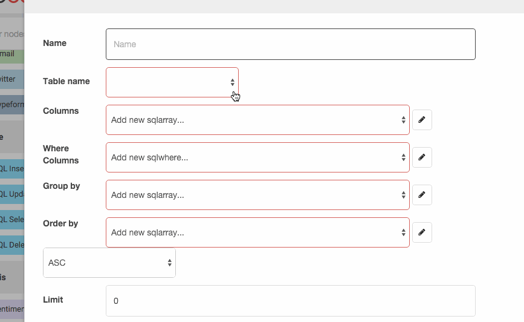
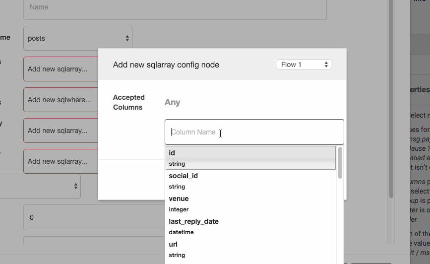
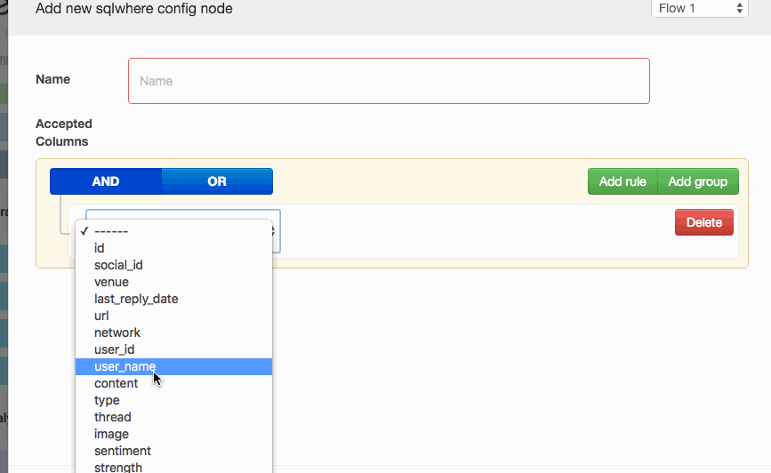

Node-red Sql Suite
========================

Install
-------

Run the following command in the root directory of your Node-RED install

    npm install node-red-contrib-sql

Overview
-------

This add-on uses new functions from Node-Red 0.13.

This add-on, includes a suite of nodes to work with Sql :

- SQL Insert
- SQL Update
- SQL Select
- SQL Delete

Know Issues
--------
For use the functions of list tables and columns you need to deploy the connection node.

## Common Parameters

### Server

Here you select a configuration node where is stored the configuration of the server.
Multiple nodes connected to the same configuration node share the same connection, is always better to use one shared connection.

### Table

The name of the table, after selecting a server the list of the tables is retrieved automatically.

### Columns

This is a filter parameter, in case of read nodes (Select) are the columns that you want to retrieve, in case of write nodes (Insert,Update) are the columns that you are making writable by the input. Every column on input if isn't in this parameter is ignored (except if this parameter is leaved empty).

### Where

This parameter is available on all nodes expect Insert. Here you can graphically construct your where clause, the columns and their types are automatically retrieved by the server (you need to Select Server and Table before use this parameter).
You can bind to every column of your where to a value, this value can be choose from the ones listed above :

 - Msg : Confront the column with the value contained in the message
 - Flow : This is a type of storage http://nodered.org/docs/writing-functions.html#flow-context
 - Global : Same as flow http://nodered.org/docs/writing-functions.html#global-context
 - Number : A float number
 - String
 
## SQL Insert

The ​*msg.payload*​ is the data that will be inserted, this data is filtered using the ​*Accepted columns*​ param, in the case the param is empty - are used all the columns available on ​*msg.payload*​.

Enabling the ​*All columns required ?*​ parameter, if in the ​*msg.payload*​ aren't available all the columns accepted by the node, the query is rejected (This param is ignored in the case the param ​*Accepted columns*​ is empty).

## SQL Update

The ​*msg.payload*​ is the data that will be updated, this data is filtered using the ​*Accepted columns*​ param, in the case the param is empty - are used all the columns available on ​*msg.payload*​.

## SQL Select

In the case a ​*msg.group*​ is passed to the node, the ​*Group by*​ parameter is overwritten, same thing for ​*msg.order*​.

For each of the ​*limit*​, ​*offset*​ parameters, in the case the value set is different from 0, the ​*msg.limit*​ / ​*msg.offset*​ is ignored.

## SQL Delete

For the ​*limit* parameter, in the case the value set is different from 0, the ​*msg.limit*​ is ignored

# ToDo

 - Complete Type Map for Sqlite3.
 - Get table columns for Sqlite3.
 - Handle the Set Type.
 - Add a button on the config to test the parameters of the connection.
 - Make the functions of list tables and columns available without deploying the connection node.
 - In the Query constructor, in case using an enum, transform the checkbox to radios for operations like "equal".
